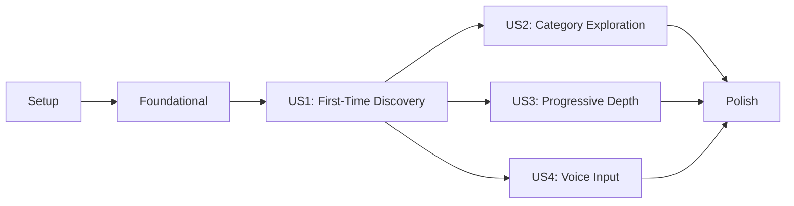

# Tasks: Question-Based Discovery Engine

**Input**: Design documents from `/specs/001-question-discovery/`
**Prerequisites**: plan.md (required), spec.md (required for user stories), research.md, data-model.md, contracts/

**Tests**: Tests are not explicitly requested in the feature specification. Following lean MVP approach.

**Organization**: Tasks are grouped by user story to enable independent implementation and testing of each story.

## Format: `[ID] [P?] [Story] Description`

- **[P]**: Can run in parallel (different files, no dependencies)
- **[Story]**: Which user story this task belongs to (e.g., US1, US2, US3)
- Include exact file paths in descriptions

## Path Conventions

- Web application: `backend/src/`, `frontend/src/`
- Paths shown follow the structure defined in plan.md

## Phase 1: Setup (Shared Infrastructure)

**Purpose**: Project initialization and basic structure

- [ ] T001 Initialize backend Node.js project with TypeScript configuration in backend/
- [ ] T002 Initialize Next.js 14 frontend with TypeScript in frontend/
- [ ] T003 [P] Configure ESLint with accessibility rules in both backend/ and frontend/
- [ ] T004 [P] Set up Tailwind CSS with senior-friendly configuration in frontend/tailwind.config.ts
- [ ] T005 [P] Install and configure Radix UI dependencies in frontend/package.json
- [ ] T006 Create Supabase project and configure environment variables in .env.local files
- [ ] T007 Set up database schema and run initial migrations using database/schema.sql
- [ ] T008 [P] Configure Vitest for unit testing in both backend/ and frontend/
- [ ] T009 [P] Set up Playwright for E2E testing in frontend/playwright.config.ts
- [ ] T010 [P] Create project documentation structure in docs/

## Phase 2: Foundational (Core Infrastructure)

**Purpose**: Core components needed by all user stories

- [ ] T011 Implement Supabase client configuration in backend/src/lib/supabase.ts
- [ ] T012 [P] Create base database models in backend/src/models/base.ts
- [ ] T013 Implement authentication service with JWT in backend/src/services/auth.service.ts
- [ ] T014 [P] Create API error handling middleware in backend/src/middleware/error.middleware.ts
- [ ] T015 [P] Implement request validation middleware in backend/src/middleware/validation.middleware.ts
- [ ] T016 Set up API routing structure in backend/src/routes/index.ts
- [ ] T017 [P] Create frontend API client service in frontend/src/lib/api/client.ts
- [ ] T018 [P] Implement authentication context provider in frontend/src/contexts/AuthContext.tsx
- [ ] T019 [P] Create base layout with accessibility features in frontend/src/app/layout.tsx
- [ ] T020 [P] Build senior-friendly button component in frontend/src/components/ui/Button.tsx
- [ ] T021 [P] Create text size adjustment component in frontend/src/components/accessibility/TextSizer.tsx
- [ ] T022 [P] Implement skip navigation links in frontend/src/components/accessibility/SkipLinks.tsx

## Phase 3: User Story 1 - First-Time Discovery Session (P1)

**Goal**: Enable new users to complete a basic discovery session and receive goal suggestions

**Independent Test Criteria**: New user can start discovery, answer 5+ questions, and receive 3-5 goal suggestions

### Backend Tasks (US1)

- [ ] T023 [US1] Create User model with RLS configuration in backend/src/models/user.model.ts
- [ ] T024 [US1] Create UserProfile model in backend/src/models/userProfile.model.ts
- [ ] T025 [US1] Create QuestionCategory model in backend/src/models/questionCategory.model.ts
- [ ] T026 [US1] Create Question model with response schema in backend/src/models/question.model.ts
- [ ] T027 [US1] Create DiscoverySession model in backend/src/models/discoverySession.model.ts
- [ ] T028 [US1] Create Response model with encryption support in backend/src/models/response.model.ts
- [ ] T029 [US1] Create Goal model in backend/src/models/goal.model.ts
- [ ] T030 [US1] Implement user registration service in backend/src/services/user.service.ts
- [ ] T031 [US1] Create discovery session service in backend/src/services/discoverySession.service.ts
- [ ] T032 [US1] Implement question selection algorithm in backend/src/services/questionSelector.service.ts
- [ ] T033 [US1] Create response recording service with encryption in backend/src/services/response.service.ts
- [ ] T034 [US1] Implement goal suggestion generator in backend/src/services/goalGenerator.service.ts
- [ ] T035 [US1] Create session state manager in backend/src/services/sessionManager.service.ts
- [ ] T036 [US1] Implement GET /discovery/categories endpoint in backend/src/routes/discovery.routes.ts
- [ ] T037 [US1] Implement POST /discovery/sessions endpoint in backend/src/routes/discovery.routes.ts
- [ ] T038 [US1] Implement GET /discovery/sessions/:id/questions/next endpoint in backend/src/routes/discovery.routes.ts
- [ ] T039 [US1] Implement POST /discovery/responses endpoint in backend/src/routes/discovery.routes.ts
- [ ] T040 [US1] Implement POST /discovery/goals/suggestions endpoint in backend/src/routes/discovery.routes.ts

### Frontend Tasks (US1)

- [ ] T041 [US1] Create discovery welcome page component in frontend/src/app/discovery/page.tsx
- [ ] T042 [US1] Build question display component in frontend/src/components/discovery/QuestionDisplay.tsx
- [ ] T043 [US1] Implement text response input component in frontend/src/components/discovery/TextResponse.tsx
- [ ] T044 [US1] Create skip question button component in frontend/src/components/discovery/SkipButton.tsx
- [ ] T045 [US1] Build progress indicator component in frontend/src/components/discovery/ProgressIndicator.tsx
- [ ] T046 [US1] Implement discovery context provider in frontend/src/contexts/DiscoveryContext.tsx
- [ ] T047 [US1] Create discovery API service in frontend/src/lib/api/discovery.service.ts
- [ ] T048 [US1] Build goal suggestion display component in frontend/src/components/goals/GoalSuggestion.tsx
- [ ] T049 [US1] Implement session auto-save functionality in frontend/src/hooks/useAutoSave.ts
- [ ] T050 [US1] Create discovery flow navigation in frontend/src/components/discovery/FlowNavigation.tsx

### Database Seeding (US1)

- [ ] T051 [US1] Create question category seed data in database/seeds/categories.sql
- [ ] T052 [US1] Create initial question bank (30 questions) in database/seeds/questions.sql
- [ ] T053 [US1] Create test user accounts in database/seeds/test-users.sql

## Phase 4: User Story 2 - Category-Based Exploration (P2)

**Goal**: Enable users to explore specific life categories with targeted questions

**Independent Test Criteria**: User can select a category, receive category-specific questions, and get relevant suggestions

### Backend Tasks (US2)

- [ ] T054 [US2] Enhance question selector for category filtering in backend/src/services/questionSelector.service.ts
- [ ] T055 [US2] Implement category-specific goal templates in backend/src/services/goalGenerator.service.ts
- [ ] T056 [US2] Create GET /discovery/sessions endpoint with category filter in backend/src/routes/discovery.routes.ts
- [ ] T057 [US2] Add category progress tracking in backend/src/services/sessionManager.service.ts

### Frontend Tasks (US2)

- [ ] T058 [US2] Create category selector component in frontend/src/components/discovery/CategorySelector.tsx
- [ ] T059 [US2] Build category card component with icons in frontend/src/components/discovery/CategoryCard.tsx
- [ ] T060 [US2] Implement category-specific progress display in frontend/src/components/discovery/CategoryProgress.tsx
- [ ] T061 [US2] Create category exploration page in frontend/src/app/discovery/category/[slug]/page.tsx
- [ ] T062 [US2] Add category switching functionality in frontend/src/hooks/useCategorySwitch.ts

### Database Updates (US2)

- [ ] T063 [US2] Add category-specific questions (20 per category) in database/seeds/category-questions.sql
- [ ] T064 [US2] Create category-specific goal templates in database/seeds/goal-templates.sql

## Phase 5: User Story 3 - Progressive Depth Discovery (P2)

**Goal**: Enable returning users to access deeper questions based on previous responses

**Independent Test Criteria**: Returning user sees new questions building on prior responses and receives refined suggestions

### Backend Tasks (US3)

- [ ] T065 [US3] Implement response analysis for depth progression in backend/src/services/responseAnalyzer.service.ts
- [ ] T066 [US3] Create conditional question logic in backend/src/services/questionSelector.service.ts
- [ ] T067 [US3] Build session history aggregator in backend/src/services/sessionHistory.service.ts
- [ ] T068 [US3] Implement GET /discovery/sessions/:id endpoint in backend/src/routes/discovery.routes.ts
- [ ] T069 [US3] Create PATCH /discovery/sessions/:id endpoint in backend/src/routes/discovery.routes.ts

### Frontend Tasks (US3)

- [ ] T070 [US3] Create returning user dashboard in frontend/src/app/discovery/dashboard/page.tsx
- [ ] T071 [US3] Build session history display component in frontend/src/components/discovery/SessionHistory.tsx
- [ ] T072 [US3] Implement progress evolution visualization in frontend/src/components/discovery/ProgressEvolution.tsx
- [ ] T073 [US3] Create deeper discovery prompt component in frontend/src/components/discovery/DeeperPrompt.tsx
- [ ] T074 [US3] Add session continuation logic in frontend/src/hooks/useContinueSession.ts

### Database Updates (US3)

- [ ] T075 [US3] Add depth level 2 questions (30 questions) in database/seeds/depth2-questions.sql
- [ ] T076 [US3] Add depth level 3 questions (20 questions) in database/seeds/depth3-questions.sql
- [ ] T077 [US3] Create question dependency relationships in database/seeds/question-dependencies.sql

## Phase 6: User Story 4 - Voice-Based Discovery (P3)

**Goal**: Enable users with typing difficulties to use voice input for responses

**Independent Test Criteria**: User can complete discovery using voice input and receive appropriate feedback

### Backend Tasks (US4)

- [ ] T078 [US4] Add voice response processing in backend/src/services/response.service.ts
- [ ] T079 [US4] Implement voice transcript storage in backend/src/models/response.model.ts

### Frontend Tasks (US4)

- [ ] T080 [US4] Create voice input component using Web Speech API in frontend/src/components/discovery/VoiceInput.tsx
- [ ] T081 [US4] Build voice recording indicator in frontend/src/components/discovery/VoiceIndicator.tsx
- [ ] T082 [US4] Implement voice response preview in frontend/src/components/discovery/VoicePreview.tsx
- [ ] T083 [US4] Create voice permission handler in frontend/src/hooks/useVoicePermission.ts
- [ ] T084 [US4] Add voice input toggle in accessibility settings in frontend/src/components/accessibility/VoiceSettings.tsx
- [ ] T085 [US4] Implement patient voice waiting logic in frontend/src/hooks/useVoicePatience.ts

## Phase 7: Polish & Cross-Cutting Concerns

**Purpose**: Final improvements, error handling, and optimization

- [ ] T086 Implement comprehensive error boundaries in frontend/src/components/ErrorBoundary.tsx
- [ ] T087 [P] Add loading states for all async operations in frontend/src/components/ui/LoadingStates.tsx
- [ ] T088 [P] Create 404 and error pages in frontend/src/app/error.tsx and frontend/src/app/not-found.tsx
- [ ] T089 Implement rate limiting on all API endpoints in backend/src/middleware/rateLimit.middleware.ts
- [ ] T090 [P] Add comprehensive logging service in backend/src/services/logger.service.ts
- [ ] T091 [P] Create health check endpoints in backend/src/routes/health.routes.ts
- [ ] T092 Implement data export functionality (GDPR) in backend/src/services/dataExport.service.ts
- [ ] T093 [P] Add performance monitoring in backend/src/middleware/performance.middleware.ts
- [ ] T094 [P] Create admin dashboard for question management in frontend/src/app/admin/questions/page.tsx
- [ ] T095 Implement automated backups in database/scripts/backup.sh
- [ ] T096 [P] Add accessibility testing suite in frontend/tests/accessibility/
- [ ] T097 [P] Create API documentation with Swagger in backend/src/docs/swagger.ts
- [ ] T098 Implement session cleanup job in backend/src/jobs/sessionCleanup.job.ts
- [ ] T099 [P] Add monitoring dashboard in frontend/src/app/admin/monitoring/page.tsx
- [ ] T100 Final security audit and penetration testing

## Dependencies & Execution Order

### User Story Dependencies



**Note**: US2, US3, and US4 can be developed in parallel after US1 is complete.

### Parallel Execution Opportunities

#### Phase 1 (Setup) - Parallel Tasks
```bash
# Can run simultaneously:
- T003: ESLint configuration
- T004: Tailwind configuration
- T005: Radix UI installation
- T008: Vitest setup
- T009: Playwright setup
- T010: Documentation structure
```

#### Phase 3 (US1) - Parallel Backend Tasks
```bash
# Models can be created in parallel:
- T023-T029: All model files (different files)

# Services can be developed in parallel after models:
- T030-T035: All service files (different files)
```

#### Phase 3 (US1) - Parallel Frontend Tasks
```bash
# Components can be built in parallel:
- T042-T045: UI components (different files)
- T048-T050: Additional components
```

## Implementation Strategy

### MVP Scope (Recommended)
**Complete Phase 1-3 (US1 only)** for initial release:
- Basic discovery flow
- Simple question/response system
- Goal suggestions
- Total: ~53 tasks

This delivers core value: users can discover goals through questions.

### Incremental Delivery
1. **Sprint 1**: Setup + Foundational (T001-T022)
2. **Sprint 2**: US1 Backend (T023-T040)
3. **Sprint 3**: US1 Frontend (T041-T053)
4. **Sprint 4**: US2 - Category exploration
5. **Sprint 5**: US3 - Progressive depth
6. **Sprint 6**: US4 - Voice input
7. **Sprint 7**: Polish & deployment

### Testing Strategy
Each user story includes:
- **Independent test criteria** in story description
- **Manual testing** via quickstart.md procedures
- **Automated E2E tests** after implementation

## Notes

- All file paths are relative to repository root
- Environment configuration required before T006
- Database migrations must complete before model tasks
- Authentication must work before discovery endpoints
- Consider accessibility testing throughout, not just at end

## Summary

**Total Tasks**: 100
**Setup & Foundational**: 22 tasks
**US1 (First-Time Discovery)**: 31 tasks
**US2 (Category Exploration)**: 11 tasks
**US3 (Progressive Depth)**: 13 tasks
**US4 (Voice Input)**: 8 tasks
**Polish**: 15 tasks

**Parallel Opportunities**: 45+ tasks can run in parallel within their phases
**MVP Recommendation**: Complete US1 (53 total tasks) for initial release